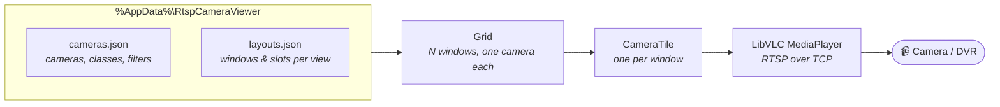

<div align="center">

# RTSP Camera Viewer

**A wall of live CCTV on one Windows screen — without a DVR client.**

Point it at any RTSP cameras, group them by site, and watch up to 16 at once.
Built for a counter or a back-office monitor that is left running all day.

[](https://github.com/ChakraDeep8/RtspCameraViewer/releases/latest)
[](#requirements)
[](#build-from-source)
[](#why-libvlc)

</div>

---

## Install

**[⬇ Download the latest installer](https://github.com/ChakraDeep8/RtspCameraViewer/releases/latest)** and run it.

One click. It installs **per user**, into `%LocalAppData%\Programs\RtspCameraViewer` — so there is
no UAC prompt, no administrator, and nothing for the person at the counter to approve. .NET and VLC
are bundled; the machine needs neither installed.

> [!NOTE]
> The installer is **not code-signed**. On machines with Smart App Control enforcing, Windows may
> block it — choose **More info → Run anyway**, or see [Troubleshooting](#troubleshooting).

Upgrading keeps everything: cameras, classes, window layouts, picture adjustments. Uninstalling
leaves your camera list alone.

---

## What it does

<table>
<tr><td width="33%" valign="top">

### 🪟 Windows you control
Pick how many tiles are on screen (**1–16**), remembered **per class**. Each window has its own
camera picker — searchable, and swapping two cameras makes them trade places rather than opening
the same stream twice.

</td><td width="33%" valign="top">

### 🎨 Picture filters
Fifteen named looks on the **live** feed — Grayscale, Sepia, Invert, Blur, Edges, Vintage and more
— plus brightness, contrast, saturation, hue and gamma sliders. Display only; the recording is
untouched.

</td><td width="33%" valign="top">

### 🗂 Classes that mean something
Group cameras by site, floor or purpose. Rename a class and every camera follows. Move a camera
between classes, rename it, or remove it — all from one list.

</td></tr>
</table>

<details>
<summary><b>📋 Full feature list</b> — click to expand</summary>

### Grid and windows
- Window count per view, **1–16**, via the stepper or `Ctrl` `+` / `Ctrl` `-`. Remembered separately
  for each class and for All Classes.
- Each window has a **source picker** (the chevron beside the camera name): search by name, class
  or URL. Choosing a camera already shown elsewhere swaps the two.
- **Move arrows** on tile edges rearrange the grid; the arrangement is stored per view and survives
  restarts.
- Column count is chosen to give each feed the **most actual pixels** for its real aspect ratio,
  rather than assuming 16:9 — re-evaluated whenever the window is resized.
- **Expand** one camera to fill the grid (⤢ button or double-click the name bar). `Esc` to go back.
- Opens **maximized**; `F11` for true full screen.

### Picture
- **Presets:** None, Grayscale, Black & White, Warm, Cool, Bright, Invert, Blur, Denoise, Edges,
  Sepia, Vintage, Posterize, Sharpen, Cartoon, Pencil Sketch, Film Grain.
- **Sliders:** brightness, contrast, saturation, hue, gamma — applied live, landing on the next
  decoded frame with no reconnect.
- Settings are stored **per camera**, so a correction follows that camera into any view.
- Available per class or on an expanded camera; deliberately not in All Classes, where it would
  mean "change everything at once".

### Cameras and classes
- Add cameras one at a time, or **import in bulk** from a file you already have: `.env`, `.txt`,
  `.csv`, `.tsv`, `.ini`, `.conf`, `.json`, `.yaml`, `.xml`, `.md` or `.xlsx`. Every `rtsp://`
  address is found and named from the surrounding context.
- **Rename** cameras, **move** them between classes, or **remove** them — Settings → Cameras.
  Nothing is written until you press Save.
- **Stream quality** per class or globally: pull the DVR's main stream or its smaller sub stream.
- **Display shape** per camera: native, 720p, 1080p, 4:3 and others, by stretching or cropping.

### Reliability
- **Auto-reconnect** every 5 seconds when a stream drops.
- **Single instance** — a second copy brings the running one to the front instead of opening,
  so two windows can never overwrite each other's camera list.
- RTSP forced over **TCP** for reliable delivery through routers and firewalls.
- Streams start **staggered**, not all at once, so they do not starve each other on open.

</details>

---

## Keyboard

| Key | Does |
|:--|:--|
| `F11` | Full screen on / off |
| `Esc` | Leave the expanded camera, or leave full screen |
| `Ctrl` `+` | One more window |
| `Ctrl` `-` | One fewer window |
| Double-click a name bar | Expand that camera |

---

## Adding cameras

Click **➕ Add Camera** and enter a name and URL:

```
rtsp://192.168.1.64:554/Streaming/Channels/101
```

Credentials can go in the **Username / Password** fields instead of the URL. The **Camera class**
box groups the camera — pick an existing class or type a new name to start one.

Have a list already? **Add Camera → Upload…** reads any file with `rtsp://` addresses in it and
imports them all into a class you choose.

---

## How it hangs together



Each window holds one camera and one decoder. The grid stores **which camera sits in which window**
per view, so a class and All Classes keep their own arrangement.

### Where your settings live

| File | Holds |
|:--|:--|
| `%AppData%\RtspCameraViewer\cameras.json` | Cameras, classes, stream quality, display shape, picture settings |
| `%AppData%\RtspCameraViewer\layouts.json` | Window count and camera-per-window, per view |
| `cameras.seed.json` *(beside the .exe, optional)* | A starting camera list for a **fresh** install — see below |

<details>
<summary><b>Seeding a new machine with your camera list</b></summary>

A fresh install starts empty. To deploy a ready-made list, copy a working
`%AppData%\RtspCameraViewer\cameras.json` next to the executable and rename it
`cameras.seed.json`. It is read **only on first run**, when the app has no list of its own, so it
never overwrites an existing setup.

`installer\build-installer.ps1` bundles the seed into the installer automatically if
`installer\cameras.seed.json` exists, and warns you when it does.

> [!WARNING]
> A real camera list contains DVR addresses and often credentials embedded in the URLs. The seed
> file is **gitignored** and must stay that way. An installer built with a seed carries those
> credentials inside it — keep it internal, and never attach it to a public release.

</details>

---

## Requirements

| | |
|:--|:--|
| **To run the installer** | Windows 10 / 11 x64. Nothing else — .NET and VLC are bundled. |
| **To build from source** | [.NET 8 SDK](https://dotnet.microsoft.com/download/dotnet/8.0), plus internet access on the first build to restore NuGet packages. |
| **To build the installer** | [Inno Setup 6](https://jrsoftware.org/isinfo.php) — `winget install --id JRSoftware.InnoSetup` |

---

## Build from source

```powershell
dotnet build RtspCameraViewer -c Release
dotnet run  --project RtspCameraViewer -c Release
```

<details>
<summary><b>Building the installer, or a portable folder</b></summary>

**Installer** — publishes a clean self-contained build and compiles `dist\RtspCameraViewer-Setup-v<version>.exe`:

```powershell
.\installer\build-installer.ps1 -Version 1.4.0
```

**Portable folder** — no installer, just a directory you can copy to another machine:

```powershell
dotnet publish RtspCameraViewer -c Release -r win-x64 --self-contained true -o publish
Remove-Item publish\libvlc\win-x86 -Recurse -Force   # 32-bit VLC an x64 build can never load
```

</details>

---

## Troubleshooting

<details>
<summary><b>Windows blocks the installer ("Application Control policy has blocked this file")</b></summary>

The binaries are unsigned, so Smart App Control treats each new build as unknown. Choose
**More info → Run anyway** if offered. Where SAC is enforcing hard there is no prompt, and the
options are to code-sign the build or to deploy from a machine where SAC is not enforcing.
Turning Smart App Control off is **permanent** — Windows gives no way to re-enable it short of a
reinstall — so weigh that before reaching for it.

</details>

<details>
<summary><b>Cameras show "Reconnecting…" and never come up</b></summary>

- Check the URL in VLC first (**Media → Open Network Stream**). If VLC cannot play it, nor can this.
- Credentials with `@` or `:` in them need to go in the Username / Password fields, not the URL.
- Many DVRs cap concurrent sessions per account. A grid of 16 can exhaust that on its own — try the
  **sub stream** (Settings → Stream quality) or fewer windows.

</details>

<details>
<summary><b>Frames tear, or feeds look smeared</b></summary>

You are past what the decoders can keep up with. The window count turns **amber** above 12 to say
so. Either reduce the windows, or switch that class to the DVR's **sub stream** — it cuts
resolution, bandwidth and decoder load together, which is what lets more cameras run at once.

</details>

<details>
<summary><b>A renamed class shows its old name</b></summary>

An older window is still open, holding the list it loaded before the rename. Close every window and
reopen. Current builds refuse to start a second copy for exactly this reason.

</details>

---

## Notes on the design

<details>
<summary><b>Why LibVLC</b></summary>

RTSP in the wild is inconsistent — H.264 and H.265, odd resolutions, DVRs that bend the spec.
[LibVLCSharp](https://github.com/videolan/libvlcsharp) handles that range better than anything else
available to .NET, and ships its own decoders so nothing needs installing on the target machine.

The video surface is a **native window**. That shapes much of the UI: anything WPF draws inside a
tile's rectangle is painted over, which is why overlays here (move arrows, pickers, flyouts) are
`Popup`s — separate windows — rather than ordinary controls.

</details>

<details>
<summary><b>Why 16 windows, and why the count turns amber at 12</b></summary>

Both numbers are measured on real hardware, not guessed. At ~26 concurrent streams VLC reported
"buffer deadlock prevented" roughly four times as often and left about half the connected streams
with no decoder at all — which presented as cameras "not opening" and torn frames on the ones that
did work. Tuning decode settings (software decoding, skipping the loop filter, single-threaded
decode) measurably did **not** help. Running fewer at a time did.

12 is where it stays reliably clean; 16 is where enough of the grid is still watchable to be worth
offering. Past 12 the count is coloured rather than capped — your screen, your call.

</details>

<details>
<summary><b>Why filter presets split into two kinds</b></summary>

Grayscale, Black & White, Warm, Cool and Bright run through LibVLC's `adjust` filter, which is
already in the render chain — they land on the next decoded frame, instantly.

The rest (Sepia, Invert, Blur, …) are VLC **filter modules**, built into the chain when the video
output is created. They cannot be swapped on a running player, so choosing one reopens that stream
for a second. The UI says which is which rather than hiding the difference.

Vignette, Solarize and Emboss are absent on purpose: LibVLC 3 ships no module that does them, and
pointing those buttons at something approximate would be a control that quietly does the wrong
thing.

</details>

<details>
<summary><b>Other deliberate choices</b></summary>

- Audio, subtitles and VLC's on-screen overlays are disabled per stream. Surveillance feeds carry no
  audio worth playing, and every enabled track costs a decoder and buffers per tile.
- `:network-caching=800` trades a little latency for far fewer dropped frames over a congested link.
- Streams open **staggered** rather than simultaneously — a whole grid negotiating RTSP in the same
  instant starves every one of them.
- Stopping a tile tears the decoder down **off** the UI thread, and the grid waits for that teardown
  before reattaching — doing otherwise crashed the process inside Direct3D.

</details>

---

<div align="center">
<sub>Built with WPF and LibVLCSharp · <a href="https://github.com/ChakraDeep8/RtspCameraViewer/releases">Releases</a> · <a href="https://github.com/ChakraDeep8/RtspCameraViewer/issues">Issues</a></sub>
</div>
